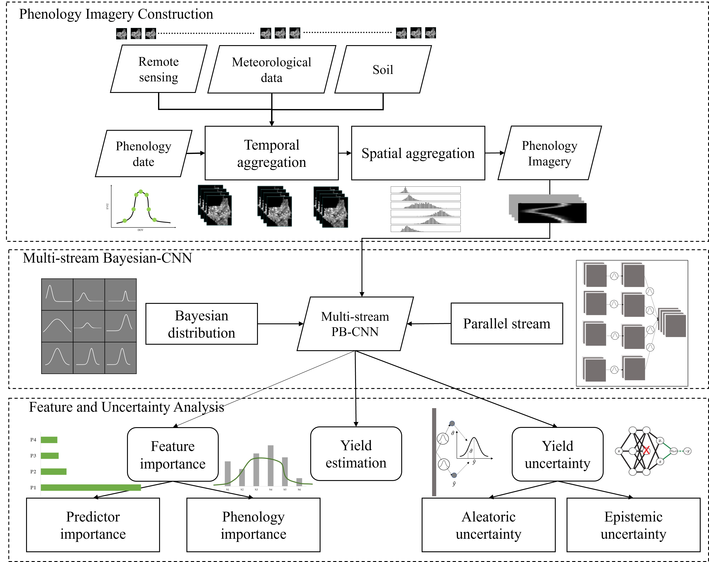

# PBCNN

This is a python implementation of the paper "A Phenology-guided Bayesian-CNN (PB-CNN) framework for soybean yield
estimation and uncertainty analysis"

* [CDL processing](./generate_CDL_modis.ipynb)
* [GEE pre-processing](./Export_US_RegionsByPheno.ipynb)
* [Model implementation](./PB-CNN.py)

## Citation
Zhang, C., & Diao, C. (2023). A Phenology-guided Bayesian-CNN (PB-CNN) framework for soybean yield estimation and uncertainty analysis. ISPRS Journal of Photogrammetry and Remote Sensing, 205, 50-73.